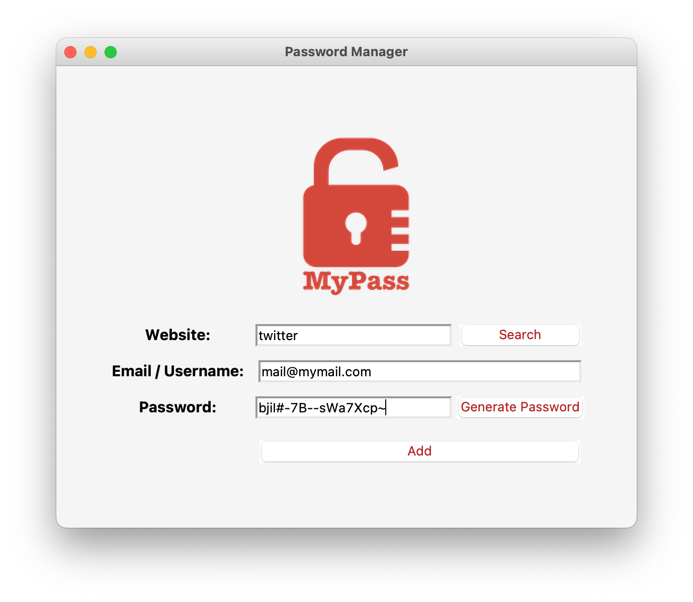
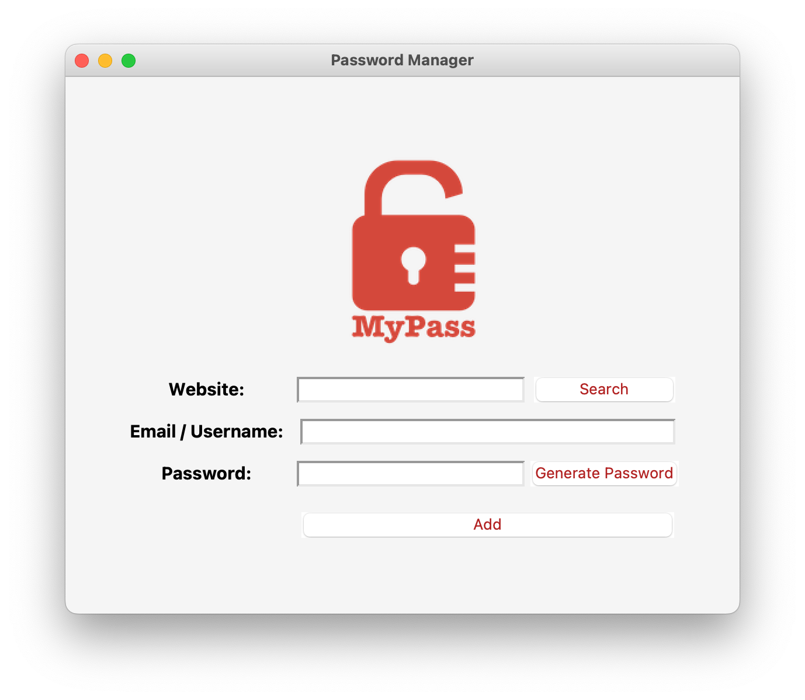
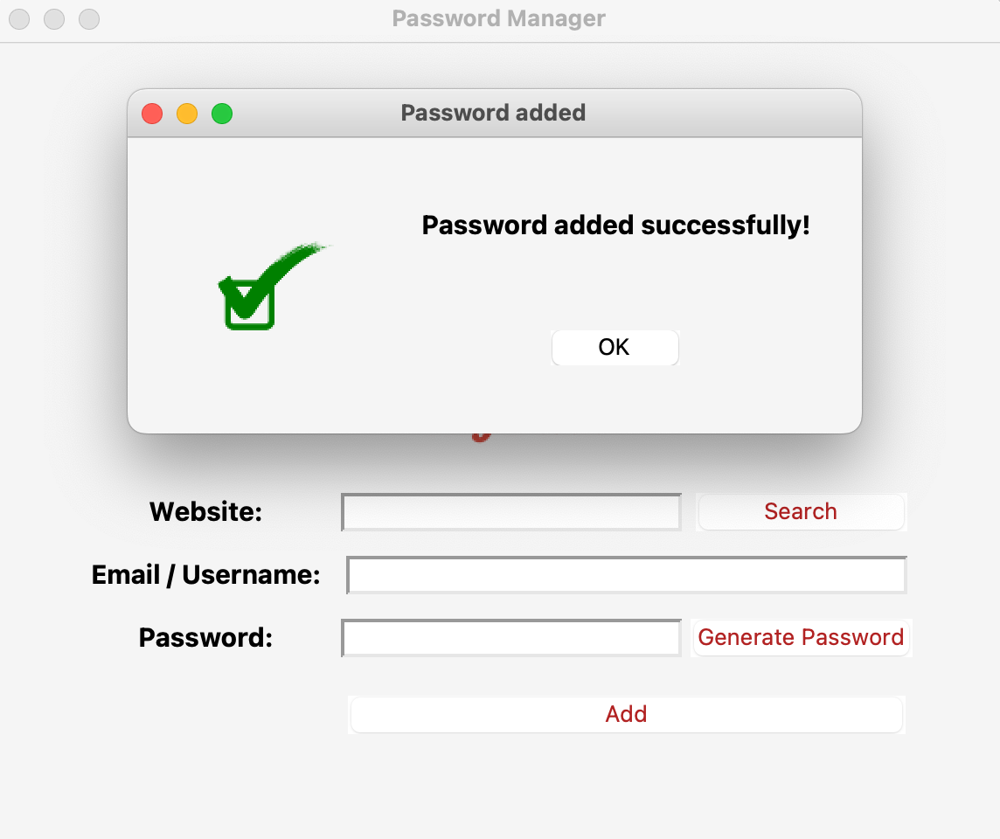
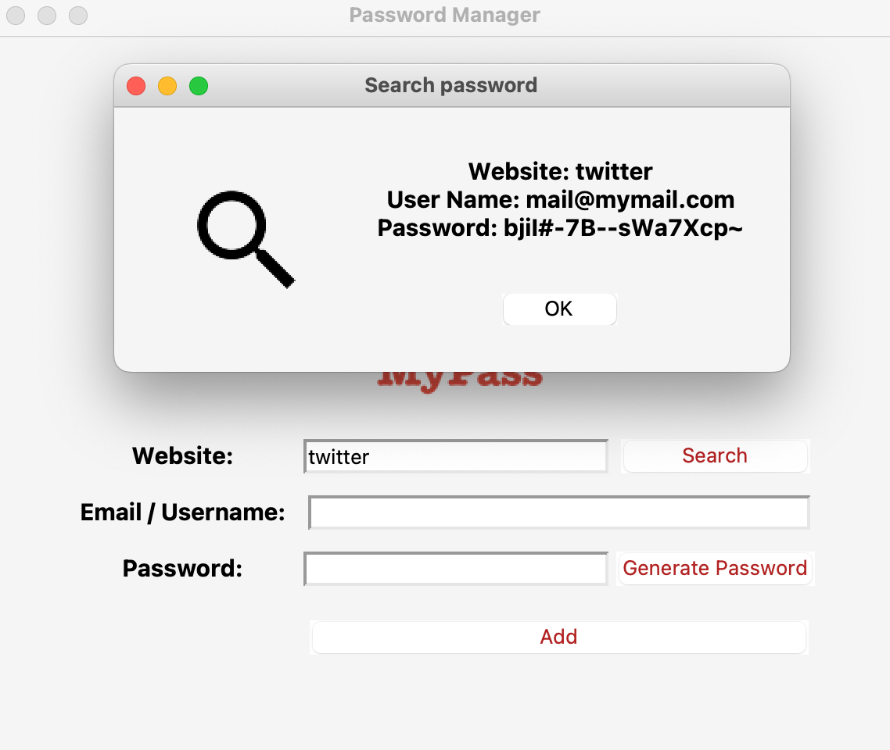
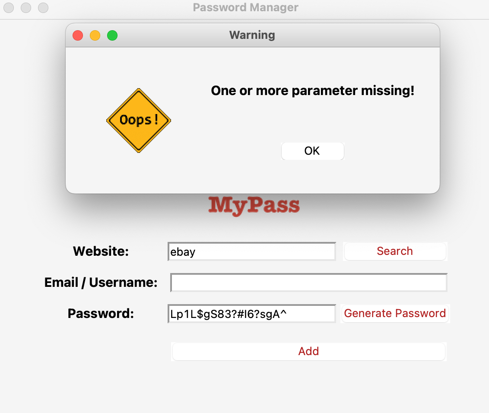

# Python3 Project: Password-Generator GUI
## About
This application manages user passwords and stores the information locally on a .JSON file.
The app saves and generates passwords on demand and also retrieves passwords according to the user's requirements.

## Source structure (Modules)
1. `main` - main function definition, user interface definition and functional operations.
2. `data` - Data for password generation.

## Usage
1. run `/python3 main.py`

The application will open in a new window

## Functionality and Screenshots

### App main page

### Add new password

### Search for existing password

### Error detection

